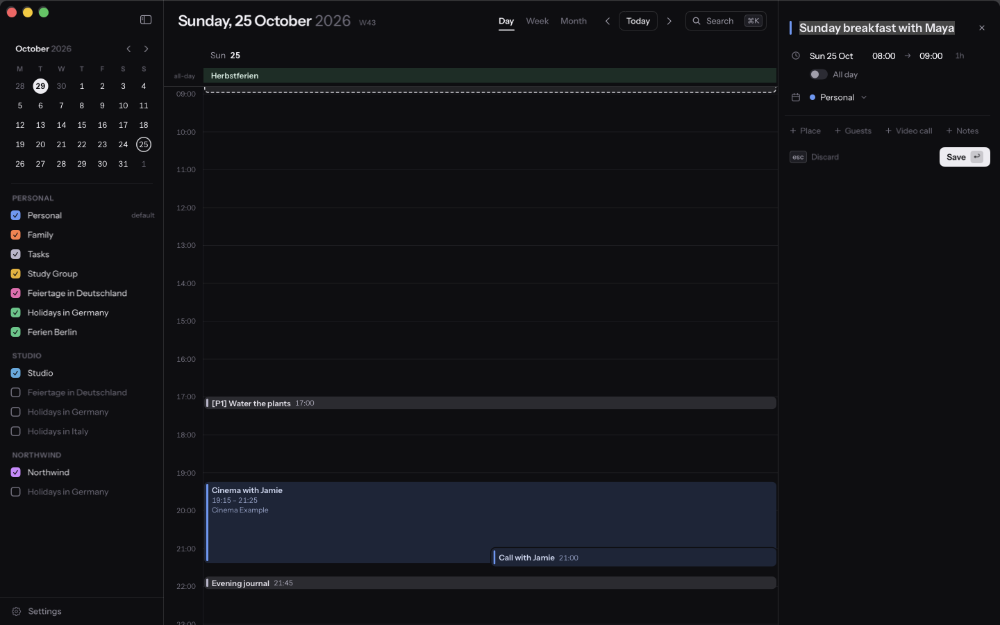
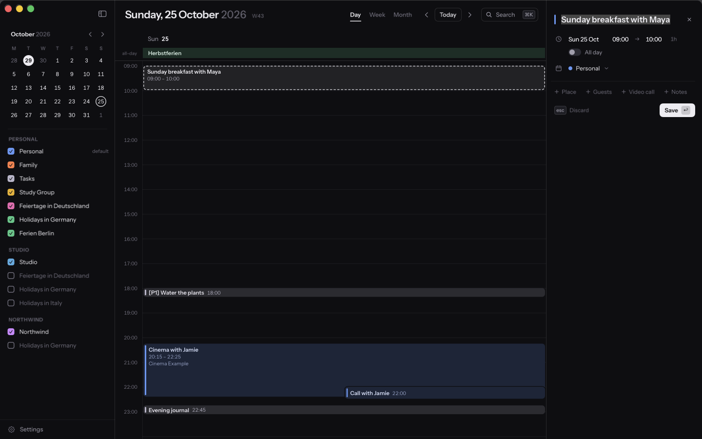
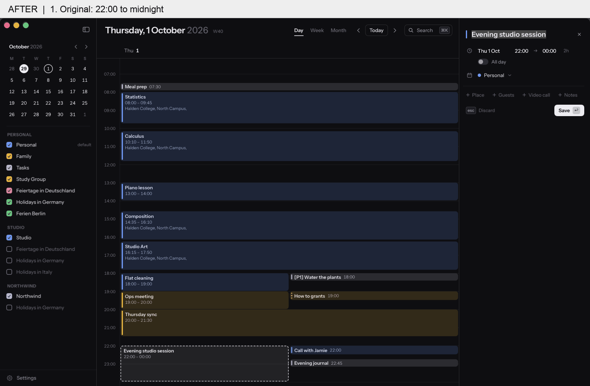
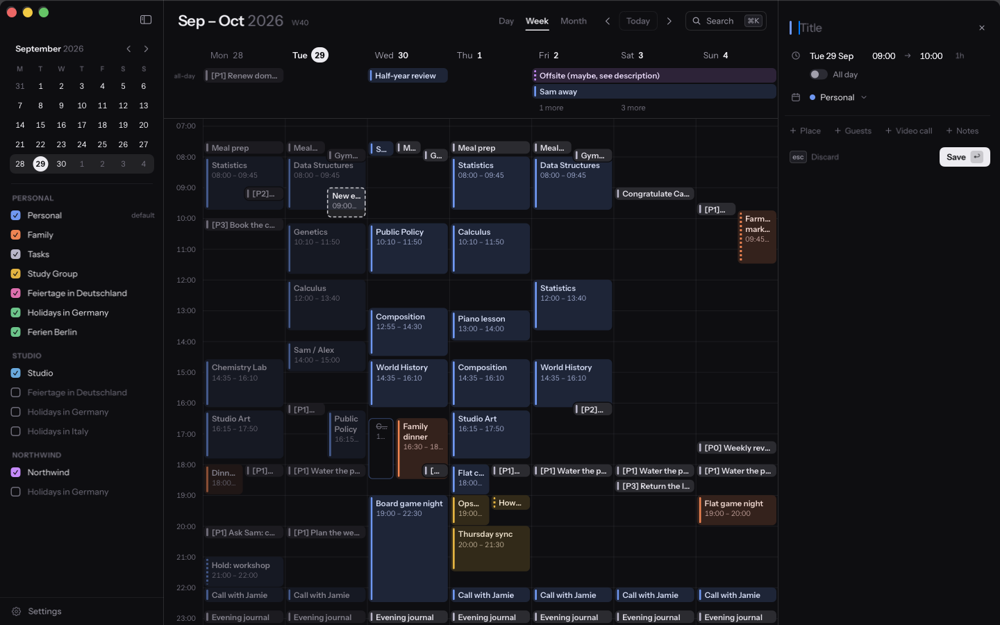
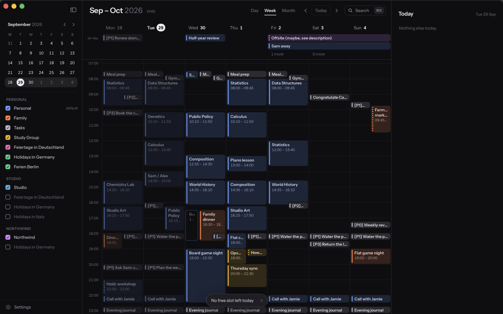
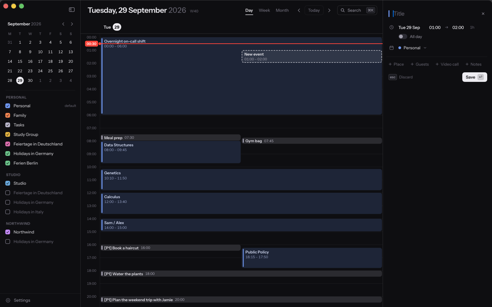
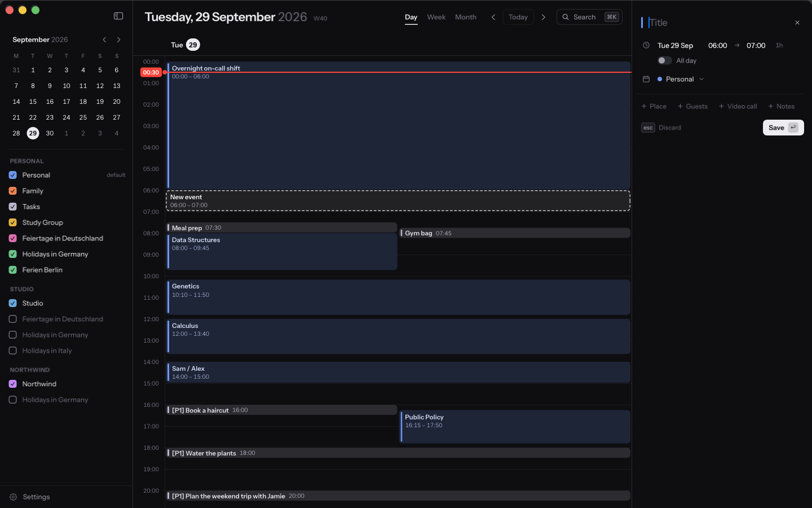

# DMG audit — 2 October 2026

Tested GitHub's latest release, [v1.1.0](https://github.com/luisKisters/calendr/releases/tag/v1.1.0), downloaded with `gh release download`. SHA-256: `a647768ff97dec3471abff79a156a84c12a89dfe8a29df610a72480941fe4ba0`. Mounted read-only, verified its signature and Applications link, and launched the mounted binary. Used the app's fictional demo calendars and realistic breakfast, studio-session and overnight-shift examples; no live calendar account was used.

The release's 189 existing tests pass. Its mounted binary passes all 48 walkthrough checks and renders 29 UI states: week/day/month, light/dark, event detail, creation, search/date/command/teammate palettes, teammate overlay, settings, shortcuts, recurring delete, read-only/permission/empty states, all-day overflow, zoom, sidebar, week numbers, guests, toast and menu-bar variants. See the `release-*.txt` logs.

| Bug and reproduction | Before | After |
| --- | --- | --- |
| Create a 09:00 slot on 25 October (Berlin's clock change): it becomes 08:00. Spring transitions shift the opposite way; 24:00 misses midnight. |  |  |
| Toggle a 22:00–midnight studio session to all-day and back: it becomes 09:00–10:00. Also affects overnight spans. |  |  |
| At 23:45, request the next free hour with C: a draft appears at 09:00 that morning. |  |  |
| With a 22:00–06:00 on-call shift, request a free slot at 00:30: a draft overlaps it at 01:00. |  |  |

Evidence is rendered by the native SwiftUI/AppKit offscreen renderer. The GIFs are labeled sequences of the three native snapshots (original → all-day on → off), not live screen recordings or animation-performance evidence. `SnapshotAudit` invokes the UI's model actions. Before captures use an otherwise unchanged release source build with only these evidence states added; after captures use the fixed build. The affected production files were identical in the downloaded release source and the original local checkout. The focused regression tests failed with 17 expectations before the fixes (`regressions-before.txt`).

Reproduce a still with `Calendr --snapshot audit-dst --out dst.png --scale 1`. Other states: `audit-midnight-initial`, `audit-midnight-all-day`, `audit-midnight-restored`, `audit-full-day`, `audit-overnight`.

Worktree check: only the original Calendr worktree existed; `.claude/worktrees` and T3's worktree directory were empty, the remote had only `main`, and no open PRs existed. This branch starts at release commit `a052fbb`; the original checkout's unpublished walkthrough changes remain separate.

Limits: Screen Recording permission is unavailable, so live pointer delivery, the native menu's on-screen appearance, remote-account sync and live EventKit saves are unverified. Menu-bar visuals use the app's native preview. The audit does not claim exhaustive coverage of every possible account or OS configuration.

## Validation and performance

The full `scripts/verify.sh` run passed: build/test gates, all 29 snapshots, 48 walkthrough assertions, a playable 62.8-second 2880×1800 H.264 video at 30 fps with 13 clicks and 35 captions, strict performance budgets, app signature, and DMG build/mount/launch/detach. After the final date-construction optimization, `scripts/verify.sh --fast` passed again with all 195 tests; the added repeated-hour assertion also passed in a focused rerun. The final binary's walkthrough, strict perf and DMG checks are rerun separately. See `fixed-*.txt` and `verification.txt`.

| Measurement | Released DMG | Fixed build |
| --- | ---: | ---: |
| Cold first drawn frame | 304 ms | 265 ms |
| Week navigation p50 / p95 | 12.0 / 16.2 ms | 11.9 / 16.1 ms |
| Month navigation p50 / p95 | 10.7 / 15.4 ms | 11.0 / 15.8 ms |
| Animated navigation initiation p50 / p95 | 14.2 / 18.2 ms | 14.5 / 19.1 ms |

Navigation uses 301–378 events per week. Both builds meet the existing unanimated p95 <16.7 ms and cold <500 ms gates; these single-machine samples do not establish a statistically significant speedup. Animated initiation remains above one 60 Hz frame at p95 and is reported separately by the existing harness; this does not measure sustained animation frame delivery. The first launch of the separate local DMG was delayed by ~24 seconds, but that did not reproduce with the downloaded release. The DST fix uses inexpensive component construction and searches the calendar only for nonexistent spring-forward times, avoiding an unnecessary matching search for every ordinary slot.

Regenerate the evidence with `python3 scripts/audit-evidence.py --binary <baseline-or-fixed-Calendr> --phase before|after` (requires Pillow). The baseline binary must include `SnapshotAudit` while retaining the release's production files.
